# AUST Student Portal - Complete Use Case Diagram

```mermaid
flowchart LR
  admin["Actor: Admin"]
  teacher["Actor: Faculty / Teacher"]
  coordinator["Actor: FYP Coordinator(s)"]
  student["Actor: Student"]
  verifier["Actor: Verification Officer / Class Representative"]
  firebase["External System: Firebase / Cloud Sync"]
  localdb["External System: Local SQLite / Device Storage"]
  printer["External System: PDF / Printer / Share"]

  subgraph portal["AUST Student Portal Application"]
    auth(("Sign in / Sign out"))
    changePassword(("Change Password"))
    bindDevice(("Bind / Release Device"))
    license(("Unlock Licensed App"))

    adminDashboard(("View Admin Dashboard"))
    featureControl(("Enable / Disable Modules"))
    assessmentAccess(("Grant Assessment Access"))
    paperAccess(("Grant Paper Tracker Access"))
    slotAccess(("Grant Slot Collection Access"))
    adminDataSync(("Import / Export Admin Data Bundle"))
    appointFyp(("Appoint One or More FYP Coordinators"))

    teacherDashboard(("View Teacher Dashboard"))
    manageAttendance(("Scan Exam Attendance QR"))
    shareAttendance(("Share / Accept Attendance Records"))
    manageAnswerSheets(("Track Answer Sheet Custody"))
    collectSlots(("Collect Per-Slot Paper Stats"))

    createAssessment(("Create Quiz / Assignment / Exam"))
    publishAssessment(("Publish Assessment QR"))
    monitorAssessment(("Monitor Live Assessment"))
    scanSubmission(("Scan Student Submission QR"))
    gradeSubmission(("Auto / Manual Grade Submissions"))
    exportResults(("Export Results"))

    scanAssessment(("Scan Teacher Assessment QR"))
    verifyAssessment(("Request / Receive Verification"))
    lockedAttempt(("Attempt Locked Quiz / Assignment"))
    answerOnly(("Select / Enter Answers Only"))
    autoSubmit(("Auto Submit on Timer or Warnings"))
    showSubmissionQr(("Show Submission QR to Teacher"))
    viewGrades(("View Grades / Marks"))
    viewCourses(("View Courses"))
    viewExamInfo(("View Seating / Exam Information"))

    verifyStudent(("Approve / Reject Student Verification"))

    fypStudentGroup(("Create FYP Group"))
    chooseMember(("Choose Group Member from Student Dropdown"))
    browseIdeas(("Browse Faculty FYP Ideas"))
    submitAllocation(("Submit Supervisor Allocation"))
    submitProposal(("Submit Proposal Cover Sheet"))
    submitSrs(("Submit SRS Document"))
    submitMeeting(("Submit Meeting Log"))
    viewEvaluation(("View FYP Evaluations"))

    fypPublishIdea(("Publish FYP Idea"))
    fypApproveSupervisor(("Approve / Reject as Supervisor"))
    fypApproveAllocation(("Approve Allocation / Consent"))
    fypFillMeeting(("Fill Supervisor Meeting Section"))
    fypEvaluate(("Enter Proposal / SRS Evaluation"))

    fypCoordinate(("Approve / Reject Any Pending FYP Group"))
    fypDirectAllot(("Create / Directly Allot Group"))
    fypAssignExaminers(("Assign Examiners"))
    fypEditGroups(("Edit / Delete FYP Groups"))

    pdfReports(("Generate / Download PDFs"))
    syncData(("Sync Data Across Devices"))
    persistData(("Persist Offline Data"))
  end

  admin --> auth
  teacher --> auth
  coordinator --> auth
  student --> auth
  verifier --> auth

  admin --> adminDashboard
  admin --> featureControl
  admin --> assessmentAccess
  admin --> paperAccess
  admin --> slotAccess
  admin --> adminDataSync
  admin --> appointFyp
  admin --> bindDevice
  admin --> license
  admin --> fypEditGroups

  teacher --> teacherDashboard
  teacher --> manageAttendance
  teacher --> shareAttendance
  teacher --> manageAnswerSheets
  teacher --> collectSlots
  teacher --> createAssessment
  teacher --> publishAssessment
  teacher --> monitorAssessment
  teacher --> scanSubmission
  teacher --> gradeSubmission
  teacher --> exportResults
  teacher --> fypPublishIdea
  teacher --> fypApproveSupervisor
  teacher --> fypApproveAllocation
  teacher --> fypFillMeeting
  teacher --> fypEvaluate

  coordinator --> fypCoordinate
  coordinator --> fypDirectAllot
  coordinator --> fypAssignExaminers
  coordinator --> fypEditGroups

  student --> viewCourses
  student --> viewExamInfo
  student --> scanAssessment
  student --> verifyAssessment
  student --> lockedAttempt
  student --> showSubmissionQr
  student --> viewGrades
  student --> fypStudentGroup
  student --> browseIdeas
  student --> submitAllocation
  student --> submitProposal
  student --> submitSrs
  student --> submitMeeting
  student --> viewEvaluation
  student --> changePassword

  verifier --> verifyStudent

  lockedAttempt --> answerOnly
  lockedAttempt --> autoSubmit
  autoSubmit --> showSubmissionQr
  scanSubmission --> gradeSubmission
  createAssessment --> publishAssessment
  publishAssessment --> scanAssessment
  verifyAssessment --> lockedAttempt

  fypStudentGroup --> chooseMember
  fypStudentGroup --> fypApproveSupervisor
  fypApproveSupervisor --> fypCoordinate
  fypCoordinate --> fypAssignExaminers
  fypDirectAllot --> fypAssignExaminers

  submitAllocation --> fypApproveAllocation
  submitMeeting --> fypFillMeeting
  submitProposal --> fypEvaluate
  submitSrs --> fypEvaluate

  createAssessment --> persistData
  scanSubmission --> persistData
  manageAttendance --> persistData
  manageAnswerSheets --> persistData
  collectSlots --> persistData
  fypStudentGroup --> persistData
  fypCoordinate --> persistData

  adminDataSync --> syncData
  syncData --> firebase
  persistData --> localdb
  pdfReports --> printer
  exportResults --> printer
  submitProposal --> pdfReports
  submitSrs --> pdfReports
  submitAllocation --> pdfReports
  manageAttendance --> pdfReports
```

## Scope Covered

- Admin controls, feature gates, access permissions, data sharing, device binding, and FYP coordinator appointment.
- Faculty assessment workflow, attendance, answer-sheet custody, slot collection, grading, exports, and FYP supervision.
- Student portal workflow, locked assessment attempts, QR submission, academic views, and FYP submissions.
- Multiple FYP coordinators with group approval, direct allotment, examiner assignment, and group management.
- Offline persistence, PDF generation, QR transfer, and cloud sync integrations.
